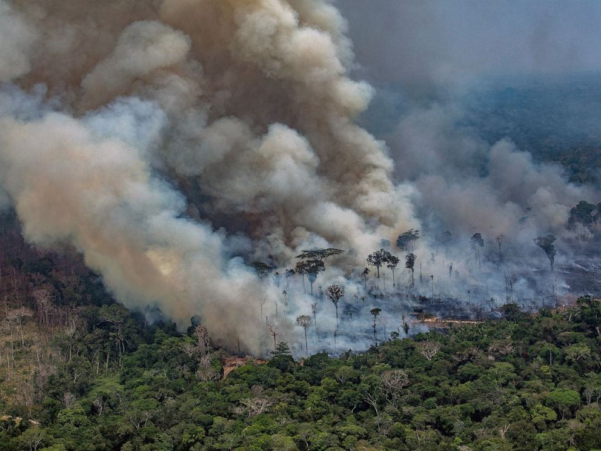
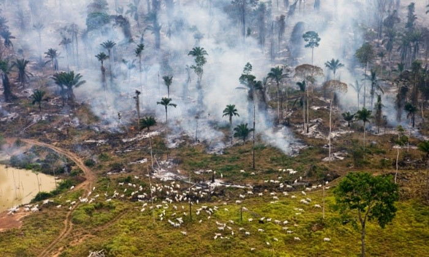

# A Close Look At Wildfires in Brazil
### An Exploratory Data Analysis of Wildfires in Brazil using Python

 

## Description
Amongst several environmental issues faced by countries of the world, wildfires seem to be the greatest challenge in Brazil. Over the past decade, the number of wildfires in this amazon country has been on the rise. As at 2021, Brazil ranks first as the country with the most wildfires in South America.  
 This Exploratory Data Analysis seeks to uncover trends and patterns in wildfires over the space of 20 years, so as to understand the spatial and temporal distributions of these fires in the country. This will provide a perspective of approach to curbing the menace.

## Project Overview
* Drew Barplots and lineplots to observe the trends in the Total number of fires in the months, years and states separately.
* Used a clustermap to understand the distribution of fires across states and months.
* Drew a choropleth map to better visualize the geographical distribution of fires in the country.
* Highlighted observations while doing all of the above

## Authors

- [@Aanuoluwa101](https://www.github.com/Aanuoluwa101)

## Resources used
 **Python** 3.10.8, Jupyter notebook  
 **Packages**: pandas, numpy, matplotlib, seaborn, shapely, geopandas

 ## Installation
 Install all package requirements by running the following command
  > pip install requirements.txt

 ## Datasets
 * The Brazilian fire dataset is available as a csv file in this repo
 * Brazilian states shapefiles are available on __https://www.kaggle.com/datasets/rodsaldanha/brazilianstatesshapefiles__

 ## Issues
 Incase you encounter any difficulty while trying to run the notebook you can raise it on the issues section.

 ## Give it a Star
 If you find this EDA useful, kindly give this repo a star so many people can get to know it.
